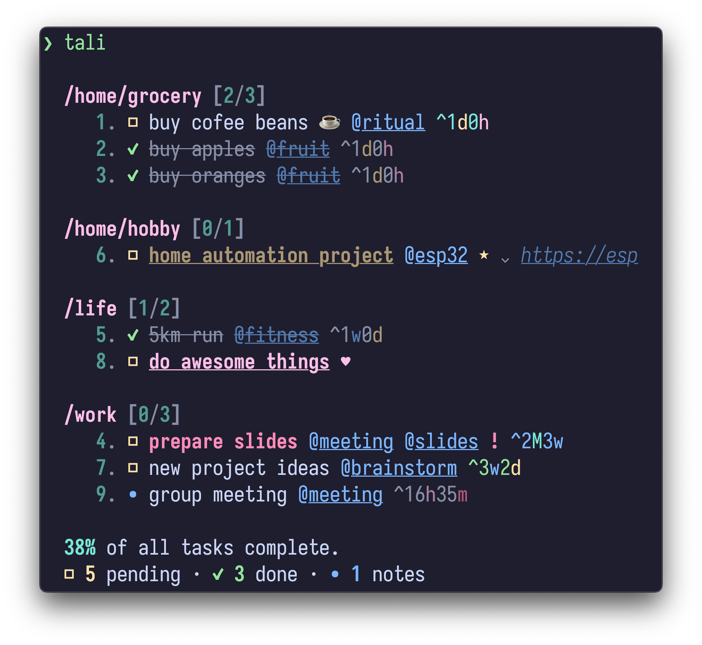

<h1 align="center">tali 🧙‍♂️</h1>

> **The CLI magic 🔮 for task alchemists** --
> Weave productivity spells with symbols
> that conjure order 📓 from chaos 🌀.

[](https://github.com/admk/tali)
[](LICENSE)
[](https://pypi.org/project/tali-cli/)
[](https://www.python.org/)
<!-- [](https://github.com/astral-sh/uv/actions) -->

`tali` is a magical command-line task manager.
It manipulates tasks with intuitive symbols
for fast yet powerful filtering, grouping, sorting and batch operations.
<p align="center">
  
</p>

## Contents

- [🔝 Top](#tali-%EF%B8%8F)
- [✨ Features](#-features)
- [📦 Installation](#-installation)
- [📖 Usage Examples](#-usage-examples)
  - [🪄 Basic Usage](#-basic-usage)
  - [🔎 Filtering & Querying](#-filtering--querying)
  - [✏️ Task Modifications](#-task-modifications)
  - [⏰ Deadline Management](#-deadline-management)
  - [📒 Batch Operations](#-batch-operations)
  - [🧪 Advanced Options](#-advanced-options)
  - [📝 Editor Usage](#-editor-usage)
- [⚙️ Configuration](#-configuration)
- [📜 Symbol Cheat Sheet](#-symbol-cheat-sheet)
- [🚀 Productivity Tips](#-productivity-tips)
  - [📟 Shell Aliases](#-shell-aliases)
  - [🎨 Syntax Highlighting](#-syntax-highlighting)
- [🧙‍♂️ Contribute](#-contribute)
- [💡 Inspired by](#-inspired-by)

## ✨ Features

- 🚀 **Fast Symbolic Syntax** --
  Intuitive symbols for fast task filtering and editing:
  `@tag`, `/project`, `^1week`.
- 🔎 **Powerful Filtering, Grouping and Sorting** --
  Filter, group and sort items with ease:
  `tali /work ! ^today @ =^`.
- 📒 **Batch Operations** --
  Modify multiple filtered tasks at once:
  `tali /grocery @fruit . ,d`
  marks tasks with tag `@fruit` in `/grocery` project as done.
- 😄 **Emoji Support** --
  Use Emoji markups for visual flair:
  💥 = `:boom:`.
- ⏪ **Undo/Redo** --
  Never fear accidental changes
  with `-u`/`--undo` and `-r`/`--redo`.
- ⚙️ **Highly Customizable** --
  Configure symbols, aliases,
  rendering format/style, editor, pager,
  database location, and more
  in `~/.config/tali/config.toml`.
- 📁 **Folder-specific Task Management** --
  Organize tasks in specific directories
  by creating a `.tali` folder in any directory.
- 📇 **JSON Storage/Export** --
  Machine-readable output with `-j`/`--json`.
- 📜 **Cheat Sheet Built-in** --
  Always available with `-c`/`--cheatsheet`.
- 1️⃣ **Idempotent Operations** --
  Use interactive editor or scripts to modify tasks.

## 📦 Installation

- Using [pip](https://pypi.org/project/pip/)
  ```bash
  pip install tali-cli
  ```

- Using [uv](https://github.com/astral-sh/uv)
  ```bash
  uv tool install tali-cli
  ```

- From source
  ```bash
  git clone https://github.com/admk/tali && cd tali && pip install .
  ```

- Requires `Python 3.10+`.

## 📖 Usage Examples

### 🪄 Basic Usage

```bash
tali . "Buy milk" /grocery ^today  # Create a task with project and deadline
tali . "Meeting notes" /work ^"tue 4pm" ,n  # Create a note
tali . "Fix bug" /tali !high @urgent  # Create high-priority task with tag
tali 42 . ,  # Toggle completion for task 42
tali 42 . ,x  # Delete task
tali ^today . @star  # Toggle star tag for all tasks due today
```

### 🔎 Filtering & Querying

```bash
tali /work !high ^today  # Show high-priority work tasks due today
tali /work + /home  # Show tasks in /work or /home
tali /work ~@waiting  # Show /work tasks without the @waiting tag
tali ^fri  # Select tasks that are due by Friday
tali @ =^  # Group tasks by tag sorted by deadline
tali 42 ?^  # Query deadline of task 42
```

### ✏️ Task Modifications

```bash
tali 42 . ,done  # Mark task 42 as done ☑️
tali 42 . ,  # Toggle task status
tali 42 . @star  # Toggle star tag ⭐
tali 42 . @fav  # Toggle favorite tag ❤️
tali 42 . !h  # Set high priority ‼️
tali 42 . ,x  # Delete task 🗑️
tali 42 . : "Details..."  # Add description
tali 42 . "New title" /newproject ,n  # Edit multiple properties
```

### ⏰ Deadline Management

```bash
tali 42 . ^+3d  # Postpone deadline by 3 days
tali 42 . ^2mon  # Set to Monday after next
tali 42 . ^M  # Set to end of month
tali 42 . ^oo  # Remove deadline
```

### 📒 Batch Operations

```bash
tali 1..5 . ,x  # Delete tasks 1-5
tali @urgent . !high  # Set all @urgent tasks to high priority
tali /home .  # Edit all tasks in /home project in text editor
```

### 🧪 Advanced Options

```bash
tali (-d|--debug) <...>  # Debug mode
tali (-j|--json) <...>  # Output in JSON format
tali (-H|--history)  # Show commit history
tali (-u|--undo)  # Undo last operation
tali (-r|--redo)  # Redo last undone operation
tali (-R|--re-index)  # Re-index database
```

### 📝 Editor Usage

You can invoke an interactive editor by running:
```bash
tali (-e|--edit)  # start an empty editor for task editing
tali <selection> .  # or edit tasks filtered by <selection>
```

In the editor,
you can write task editing or adding commands
without the `tali` prefix.
When you save and close the editor:
- Each line will be treated as a separate command
- Commands will be executed sequentially
- Supports recursive prefix sharing for faster editing

Example:
```
. /home/grocery ^today buy
  @fruit
    apples
    oranges
  milk
```

This would be interpreted as:
```
. /home/grocery ^today @fruit buy apples
. /home/grocery ^today @fruit buy oranges
. /home/grocery ^today buy milk
```

To add nested tasks without knowing the parent's ID,
start each nested child line with `.`:
```
. /work release checklist
  . draft outline
  . collect screenshots
    . crop hero image
```

Indented lines without a leading `.` still use prefix sharing.
This also works inside nested blocks:
```
. /work
  release checklist
    @urgent
      . draft outline
      . collect screenshots
```

For multi-line descriptions in editor mode,
use indented `:` lines under the task:
```
. /work release checklist
  : First description line.
  : Second description line.
```

For longer descriptions,
use a fenced block.
The fence defaults to `"""`
and can be changed with `token.description_fence`:
```
. /work release checklist : """
First description line.
Second description line.
"""
```

## ⚙️ Configuration

Global configuration is stored in `~/.config/tali/config.yaml`
(or `$XDG_CONFIG_HOME/tali/config.yaml`).
It also uses `.tali/config.yaml` in your project directory
for project-specific setting overrides if it exists.
Edit with:
```bash
tali --edit-rc
```
See [config.yaml](tali/config.yaml) for all default configurations.
See [Configuration Guide][config_guide]
for details of how to customize `tali`.

## 📜 Symbol Cheat Sheet

| Token | Name        | Description                       | Example         |
|------:|-------------|-----------------------------------|-----------------|
| `.`   | separator   | Separates selection from action   | `1..3 . ,done`  |
| `..`  | id range    | Range of item IDs                 | `1..5`          |
| `,`   | status      | Task status (see values below)    | `,pending`      |
| `/`   | project     | Project category                  | `/work`         |
| `@`   | tag         | Custom tag                        | `@critical`     |
| `!`   | priority    | Priority level (see values below) | `!high`         |
| `^`   | deadline    | Due date/time expression          | `^tomorrow`     |
| `=`   | sort        | Sort results                      | `=!` (priority) |
| `?`   | query       | Query attributes                  | `?^` (deadline) |
| `:`   | description | Long description                  | `: details...`  |
| `+`   | or          | OR between selection clauses      | `/work + /home` |
| `~`   | not         | Negate the next selection filter  | `~@waiting`     |
| `-`   | stdin       | Read from standard input          | `-`             |

Settable token values:

- Status accepts `pending`, `done`, `note`, `archive`, and `delete`.
  Default aliases are `p`, `d`/`c`, `n`, `a`, and `x`.
  A bare `,` action toggles `pending`/`done`.
- Priority accepts `high`, `normal`, and `low`.
  Default aliases are `h`, `n`, and `l`.
  A bare `!` action sets high priority;
  `!+` raises priority and `!-` lowers it.
- Deadline accepts date expressions such as `today`, `tomorrow`, `feb21`,
  `10am`, `mon`, `+3d`, `-1w`, and `+M1d`.
  Quote values with spaces, for example `^"tue 4pm"`.
  In actions, `^oo` clears the deadline.
- Selection adjacency is AND, a standalone `+` is OR, and `~` negates the
  next selection filter.

## 🚀 Productivity Tips

### 📟 Shell Aliases

Use `t` as an alias for `tali`.
For example:
1. Add the following line to your `~/.bashrc` or `~/.zshrc`:
   ```bash
   alias t='tali'
   ```
2. `source ~/.bashrc` or `source ~/.zshrc`
   to apply the changes.
3. Use `t <...>` instead of `tali <...>` for extra speed.

### 🎨 Syntax Highlighting

- Use [`tali.vim`][tali.vim] for Neovim/Vim syntax highlighting.
  Install with [lazy.nvim][lazy.nvim]:
  ```lua
  {
    "admk/tali.nvim",
    ft = "tali",
  }
  ```
- Color theme: [Catppuccin Mocha][catppuccin]
  <details open>
    <summary>Screenshot</summary>
  <p align="center">
    
  </p>
  </details>

## 🧙‍♂️ Contribute

- ❓ Need Help? [FAQs][faqs]
- 🔮 Report bugs: [Issue Tracker][issues]
- 📥 Submit PRs: [Pull Requests][prs]
- 💬 Discuss: [Discussions][discussions]

## 💡 Inspired by

- [taskbook][taskbook]:
  Tasks, boards & notes for the command-line habitat.
- [taskwarrior][taskwarrior]:
  A command line task list management utility.

[config_guide]: https://github.com/admk/tali/blob/main/CONFIGURATION.md
[faqs]: https://github.com/admk/tali/wiki/faqs
[issues]: https://github.com/admk/tali/issues
[prs]: https://github.com/admk/tali/pulls
[discussions]: https://github.com/admk/tali/discussions
[tali.vim]: https://github.com/admk/tali.vim
[lazy.nvim]: https://github.com/folke/lazy.nvim
[catppuccin]: https://github.com/catppuccin/nvim
[taskbook]: https://github.com/klaudiosinani/taskbook
[taskwarrior]: https://github.com/GothenburgBitFactory/taskwarrior
