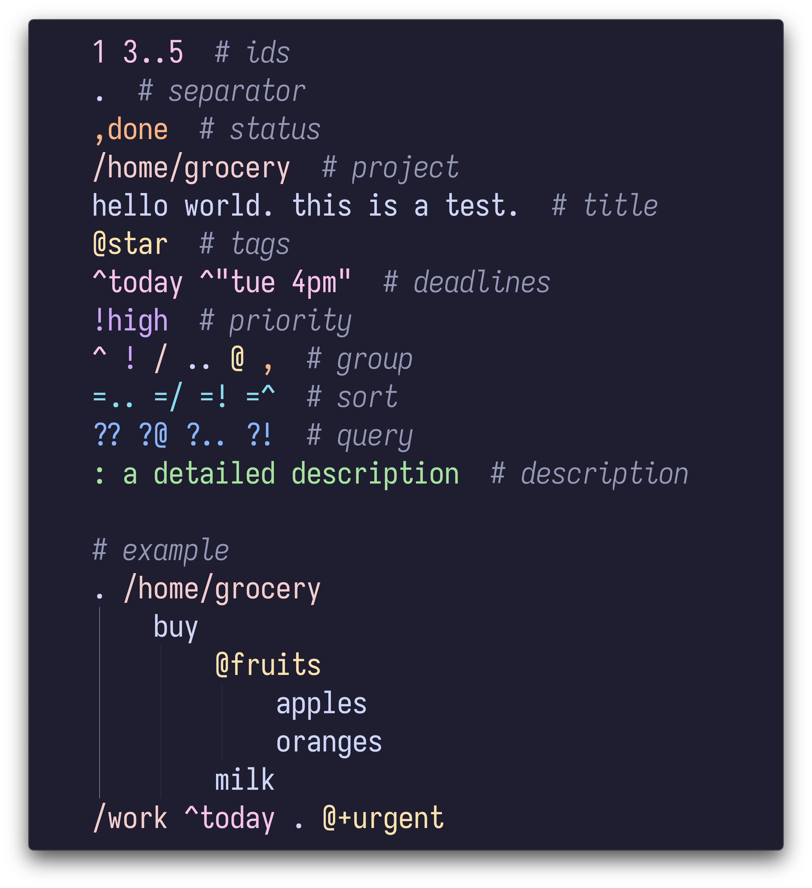

# tali.vim

Neovim / Vim syntax highlighting for [tali][tali].

## Screenshot

<p align="center">
  
</p>

## Installation

- [**lazy.nvim**][lazy.nvim] (for Neovim):
  ```lua
  {
    "admk/tali",
    ft = "tali",
    rtp = "vim",
  },
  ```

- [**vim-plug**][vim-plug] (for Vim):
  ```vim
  call plug#begin('~/.vim/plugged')
    Plug 'admk/tali', { 'rtp': 'vim', 'for': 'tali' }
  call plug#end()
  ```

[tali]: https://github.com/admk/tali
[lazy.nvim]: https://github.com/folke/lazy.nvim
[vim-plug]: https://github.com/junegunn/vim-plug
